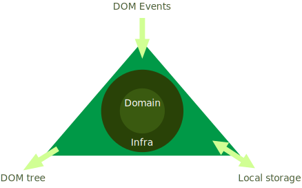

# Locutio

An approach to Ports and Adapters clean architecture from the frameworkless client application perspective

#### Features
 - Project files organization corresponding to the core, application and external communications idea.
 - DOM and Events as external communications.
 - Business logic represents a microblogging application.
 
All is written on plain vanilla JavaScript.

-----

## Architecture

- Domain
- Infra
- Services
  
The main idea is to hace our core business logic ignorant of the external world, then some kid of adapters will use the dependency inversion principle, however the current version of ECMAScript doesn't have Interfaces* so we'll use the instances and classes.



> *We could use factory patterns to simulate the interfaces

```seq
DOM->Controller: Event
Controller->Service: extract action from event 
Service->Repository: Operate CRUD from repo
```